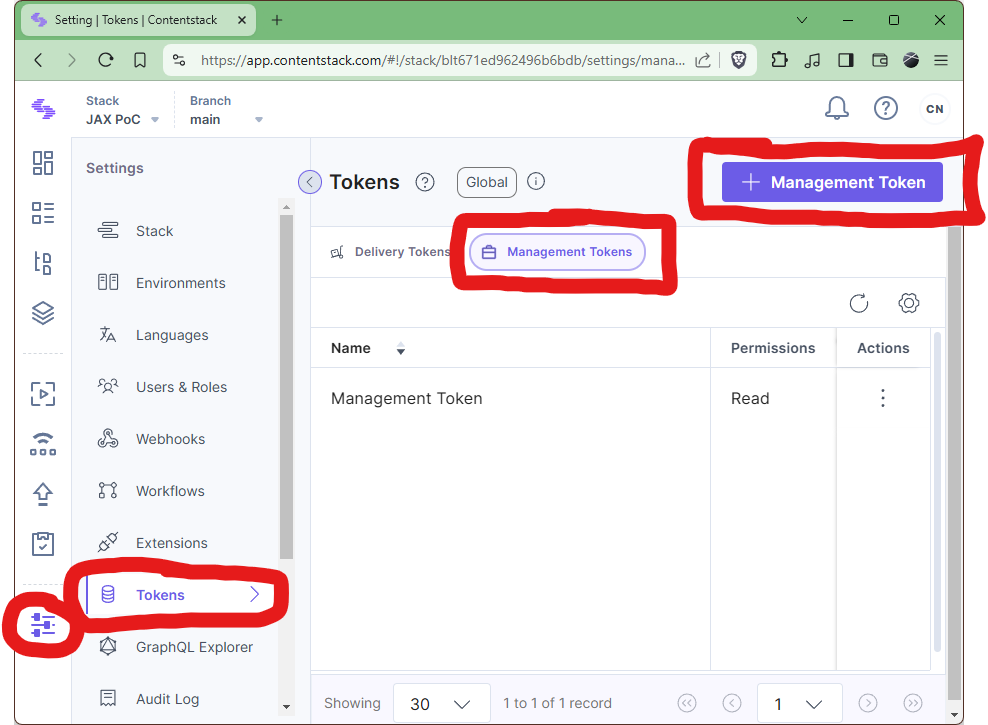

# Developing with Contentstack

For purposes of local development, individual developers should maintain their
own account and their own private development stack within Contentstack. Use
the Arke Partner Sandbox account for this purpose.

## Preparing your Stack

- Get access to the Arke Partner Sandbox. Reach out to team members for help.

- Create a stack in the Arke Partner Sandbox. Name it something descriptive,
  preferably `Beacon Dev (<your last name>)`.

- In your stack settings, create a management token. The token should have
  **Write** permission to **All Branches**. Store the token in the `.env` file
  in the repository root, using the name `Contentstack_Management_Token`.
  This value should be treated like a password: do not commit your token to
  source control.

  

- On the page detailing the management token, you will also find an API key.
  This API key is used to identify your stack specifically. Store the API key
  in your `.env` file, using the name `Contentstack_Api_Key`. This value is
  not sensitive, but you still probably have no reason to commit it to source
  control.
