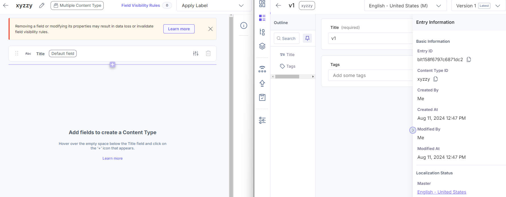

# Working with Entries

Importing and exporting entries has some surprising behavior.

Consider the following content type and entry:



When this entry is exported, it produces the following structure:

```yaml
title: v1
tags: []
locale: en-us
uid: blt158f6797c6871dc2
created_by: blt8f75c5f93fe13124
updated_by: blt8f75c5f93fe13124
created_at: '2024-08-11T16:47:56.992Z'
updated_at: '2024-08-11T16:47:56.992Z'
_version: 1
_in_progress: false
```

Making an update to the entry and exporting it again produces a similar result:

```yaml
title: v2
tags: []
locale: en-us
uid: blt158f6797c6871dc2
created_by: blt8f75c5f93fe13124
updated_by: blt8f75c5f93fe13124
created_at: '2024-08-11T16:47:56.992Z'
updated_at: '2024-08-11T16:50:36.486Z'
_version: 2
_in_progress: false
```

Note that the `_version` field has been updated from `1` to `2` and the
`updated_at` field has been updated to reflect the time of the update.

**Version 1 information has been lost**. This appears to be limitation of the
Contentstack import/export process.

---

Consider this workflow:

1. Create an entry.
2. Export the entry.
3. Delete the entry.
4. Import the entry.

The entry now has a new `uid` value.

This is unexpected because step 4, the import, included the original `uid`,
and because the original entry had been deleted, the `uid` should have been
available again.

Once a `uid` is assigned, it is never re-used, even if we wish it were.

This means we cannot really trust that the `uid` value can be used to
associate an entry in Contentstack with the corresponding entry in the
file system.

- _Lesson_: We shouldn't be using the uid as a key value.

This is a real problem because the workflow described here is similar to what
I would expect a dev to encounter if they are switching branches a lot.

---

There is another workflow that causes issues:

1. Create an entry.
2. Export the entry.
3. Mutate the serialized export (but do not change the `uid` or `version`).
4. Import the mutated export.

In this case, the mutated import successfully updates the original entry,
but it unexpectedly creates a new version number.

Re-exporting the entry includes the _latest_ version but not _all_ versions.

- _Lesson_: We should not be considering the version number when comparing
  for equality.

---

Q: What happens if you try to import an entry that has a duplicate title?
A: Contentstack API refuses the import and reports that the title is not unique.

---

If you examine the serialized export of a content type, there is this curious
little section:

```yaml
options:
  is_page: false
  singleton: false
  sub_title: []
  title: title
```

The `title` field there _looks_ like it might be used to control which field
in the schema represents the title of the entry.

I have experimented with this and found nothing useful:

- In the Contentstack UI, it is not possible to delete the default
  "Title" field, or to change the default `uid` (which is always `title`).
  Since the UI actively prevents changes to this, it suggests that any workflow
  that depends on this field being mutable is not supported.

- However, using the API, I was able to add a new `title2` field with the same
  properties as the `title` field, and change the `options.title` to point to
  my new `title2` field instead. This did not change any obvious behavior of
  Contentstack: entries _still used the `title` field as the title_.

- Also using the API, I was able to remove the default `title` field. The
  UI responded by showing all entries as `Untitled`, even though my
  `options.title` field was still set to `title2`.

- _Lesson_: The `options.title` field is not useful for controlling the title,
  the title field is not mutable, and we can depend on the `title` field being
  the title of the entry. If the `title` field is absent, we should default
  to `Untitled`.

---

Tests:

- ✓ Export an entry. Does the data structure match expectations?

- ✓ Re-export the same entry without changing it. The serialization should
  report as being unmodified.

- ✓ Change the entry, then re-export it. The serialization should report as
  being updated.

- ✓ Export an entry, then delete it, then re-export. The serialization should
  report as being deleted.

- ✓ Export an entry, then import it. The entry should report as unmodified.

- ✓ Export an entry, delete it, then import it. Was it re-created?

- ✓ Export an entry, change it, then import it. The entry should report as
  modified. **Works, but a new version was created unexpectedly.**

- ✓ Export an entry, change it, then import it, then re-export it. Was the
  serialization listed as un-modified?

- ✓ Export an entry, delete the serialization, then import. Was the
  entry deleted?
